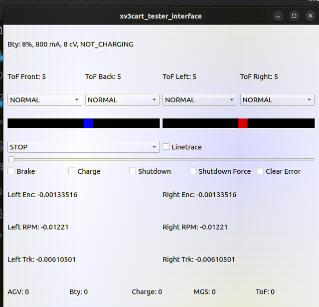

# xv3cart_firmware_mock

## Usage

### Terminal 1 (Open virtual serial port)

```bash
socat -d -d pty,raw,echo=0 pty,raw,echo=0
```

After running the above command, you will get two devices, for example `/dev/pts/3` and `/dev/pts/4`. You can use `/dev/pts/3` as the serial port for the firmware mock.

### Terminal 2 (Open mock)

```bash
ros2 run xv3cart_firmware_mock xv3cart_firmware_mock /dev/pts/2
```

### Terminal 3 (Open tester interface)

```bash
ros2 run xv3cart_tester_interface xv3cart_tester_interface /dev/pts/3
```


